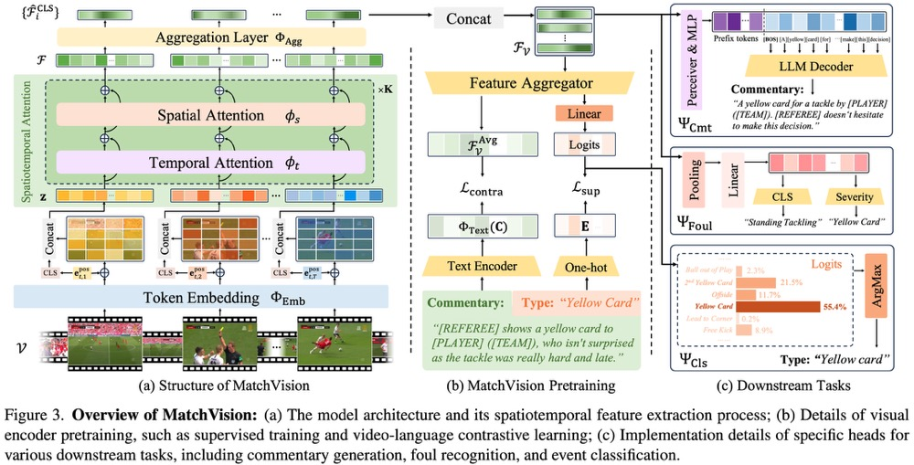
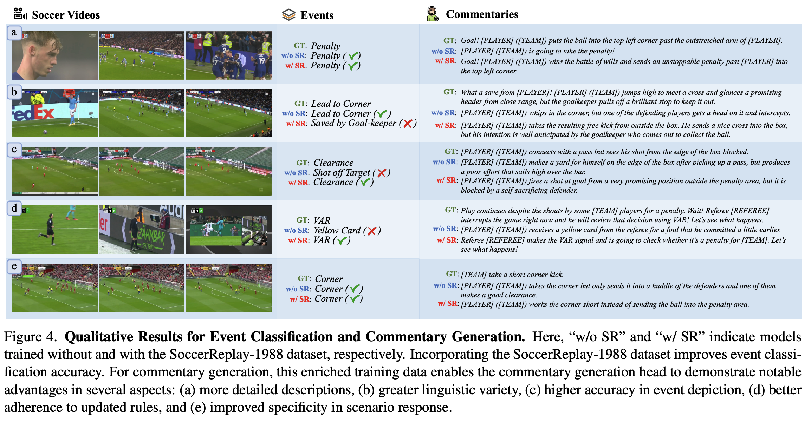

# UniSoccer: Towards Universal Soccer Video Understanding (CVPR 2025)
This repository contains the official PyTorch implementation of paper **"Towards Universal Soccer Video Understanding"**: https://arxiv.org/abs/2412.01820/.

[Project Page](https://jyrao.github.io/UniSoccer/)  $\cdot$ [Paper](https://arxiv.org/abs/2412.01820/) $\cdot$ [Dataset](https://huggingface.co/datasets/Homie0609/SoccerReplay-1988) $\cdot$ [Checkpoints](https://huggingface.co/Homie0609/UniSoccer) 

<div align="center">
   
</div>

## News
- [2025.03] We have open-sourced our dataset, please fill out some forms to obtain access.
- [2025.02] 🎉Our paper has been accepted to CVPR 2025.
- [2025.01] We have open-sourced our codes and checkpoints for UniSoccer.
- [2024.12] Our pre-print paper is released on arXiv.

## Requirements
- Python >= 3.8 (Recommend to use [Anaconda](https://www.anaconda.com/download/#linux) or [Miniconda](https://docs.conda.io/en/latest/miniconda.html))
- [PyTorch >= 2.0.0](https://pytorch.org/) (If use A100)
- transformers >= 4.42.3
- pycocoevalcap >= 1.2

A suitable [conda](https://conda.io/) environment named `UniSoccer` can be created and activated with:

```
conda env create -f environment.yaml
conda activate UniSoccer
```

## Train

<div align="center">
   
</div>

#### Pretrain MatchVision Encoder
As described in paper, we have two methods for pretraining MatchVision backbone (supervised classification & contrastive commentary). You can train both this two methods as following shows:


First of all, you should prepare textual data as the format in `train_data/json`, and preprocess soccer videos into 30 second clips (15s before and after timestamps) for pretraining.

**Supervised Classification**
```
python task/pretrain_MatchVoice_Classifier.py config/pretrain_classification.py
```
**Contrastive Commentary Retrieval**
```
python task/pretrain_contrastive.py config/pretrain_contrastive.py
```

Also, you could finetune MatchVision with
```
python task/finetune_contrastive.py config/finetune_contrastive.py
```
To be noted, you should replace the folders in task and config files.

#### Train Downstream Tasks

You could train the commentary task by several different methods:

1. Use mp4 files
```
python task/downstream_commentary_new_benchmark.py 
```
For this method, you might train the commentary model MatchVoice with open visual encoder or language decoder, so you should crop the videos as 30s clips named as json files shows.

2. Use *.npy* files
```
python task/downstream_commentary.py
```
For this method, you cannot open the visual encoder, so you can extract features of all video clips and change ".mp4" by ".npy" as file names.

**To be noted,** folder `words_world` records the token ids of all words in LLaMA-3(8B) tokenizer of different datasets as

- *`match_time.pkl`*: MatchTime dataset ([Link here](https://huggingface.co/datasets/Homie0609/MatchTime))
- *`soccerreplay-1988.pkl`*: SoccerReplay-1988 dataset. (Not released yet)
- *`merge.pkl`*: Union set of MatchTime & SoccerReplay-1988


## Inference

<div align="center">
   
</div>

For inference, you could use the following codes, be sure that you have correctly crop the video clips, which is in the same format as before.
```
python inference/inference.py
```
Then, you could test the metrics for output `sample.csv` by:
```
python inference/score_single.py --csv_path inference/sample.csv
```

## Citation
If you use this code and data for your research or project, please cite:

	@InProceedings{rao2024unisoccer,
            title   = {Towards Universal Soccer Video Understanding},
            author  = {Rao, Jiayuan and Wu, Haoning and Jiang, Hao and Zhang, Ya and Wang, Yanfeng and Xie, Weidi},
            booktitle = {Proceedings of the IEEE/CVF Conference on Computer Vision and Pattern Recognition (CVPR)},
            year    = {2025},
      }

## TODO
- [x] Release Paper
- [x] Release Checkpoints
- [x] Release Dataset
- [x] Code of Visual Encoder Pretraining
- [x] Code of Downstream Tasks
- [x] Code of Inference
- [x] Code of Evaluation


## Acknowledgements
Many thanks to the code bases from [Video-LLaMA](https://github.com/DAMO-NLP-SG/Video-LLaMA) and [MatchTime](https://github.com/jyrao/MatchTime), and source data from [SoccerNet-Caption](https://arxiv.org/abs/2304.04565) and [MatchTime](https://github.com/jyrao/MatchTime).


## Contact
If you have any questions, please feel free to contact jy_rao@sjtu.edu.cn or haoningwu3639@gmail.com.
